# MODULE 3 : Harness Engineering,Context Engineering et Projet Final

**Durée** : 1 journée (7h)  
**Objectifs** : Maîtriser le Context Engineering, utiliser l'IA pour le cycle complet de développement et réaliser un projet collaboratif final

---

## 🎯 Objectifs pédagogiques

- Maîtriser le concept de harness engineering
- Maîtriser le concept de Contrat de Contexte et ses 5 piliers
- Utiliser l'IA pour le débogage, l'optimisation, les tests et la revue de code
- Présenter la méthode de travail Stage Gate
- Orchestrer plusieurs agents IA dans un projet collaboratif
- Analyser de manière critique les limites et opportunités de l'IA en développement

---

## 📅 Planning de la journée

| Horaire | Module | Durée | Contenu |
|:--------|:-------|:------|:--------|
| **9h15 - 10h15** | **Harness Engineering & Contrat de Contexte** | 60min | Harness Engineering, Contrat de contexte, template contrat de contexte |
| **10h15 - 10h30** | **☕ PAUSE** | 15min | |
| **10h00 - 12h30** | **IA : Debug, Optim, Tests, Review** | 150min | IA pour débogage, optimisation code, génération tests, revue code, exercice pratique |
| **12h30 - 13h30** | **🍽️ PAUSE DÉJEUNER** | 60min | |
| **13h30 - 14h00** | **Stage Gate** | 30min | Présentation de la méthode de travail Stage Gate |
| **14h00 - 17h00** | **TP Final - Projet Collaboratif** | 210min | Orchestration multi-agents : P.O., Architecte, Développement, QA, Code Review, analyse critique |
| **17h00 - 17h30** | **Conclusion Formation** | 30min | Synthèse, évaluation, prochaines étapes |

---

## 📚 Contenu détaillé

### 1. Harness Engineering & Contrat de Contexte

#### 1.1 Harness Engineering

Le harness engineering est l'art de créer un environnement de travail pour les agents IA. 
Il permet de s'assurer que l'agent IA comprend bien le contexte et qu'il peut fournir des résultats précis, pertinents et utiles.

C'est la capacité à orienter l'IA pour qu'elle produise des résultats pertinents et utiles. C'est l'équivalent de la capacité à conduire une voiture.

#### 1.2 Le Contrat de Contexte

Le contrat de contexte est un document qui permet de définir le contexte dans lequel le ou les agents IA doivent travailler. 
Il permet de s'assurer que l'agent IA comprend bien le contexte et qu'il peut fournir des résultats précis, pertinents et utiles.

C'est un livrable projet. Il sert de référence entre les différentes parties prenantes du projets.

Il peut servir de base à un AGENTS.md mais ce n'est pas sa vocation première. Certaines informations du contrat de contexte peuvent n'avoir aucune pertinence pour l'agent IA, notamment dans le cas des projets multi-repositories.

C'est l'équivalent de savoir entretenir sa voiture, faire le plein, vérifier les pneus, faire des pauses, utiliser son GPS, etc.

##### Les 5 Piliers du Contrat de Contexte

1. **Objectif** : Clarifier l'objectif attendu  
   *"Concevoir une architecture microservices pour une application e-commerce"*

2. **Contraintes** : Spécifier les limitations et exigences  
   *"Stack: Python/FastAPI, Cloud: AWS, Budget: limité, Skills: Architect-Scheme-Designer"*

3. **Contexte** : Fournir le contexte projet  
   *"Projet existant en monolithe, 50k utilisateurs/jour, équipe de 2 devs + un architecte"*

4. **Format** : Définir le format de sortie attendu  
   *"Diagramme C4, fichiers de config, ADR"*

5. **Validation** : Critères de succès  
   *"Respect patterns SOLID, tests >80%, documentation complète"*

##### Template de Contrat de Contexte
```markdown
## CONTRAT DE CONTEXTE [NOM DE L'AGENT]

### Objectif
[But précis à atteindre]

### Contraintes
- Technique : [langages, frameworks, outils]
- Business : [délais, budget, scope]
- Qualité : [couverture tests, performance, sécurité]
- Vibe coding : [skills, MCP]

### Contexte
[Informations sur le projet, l'équipe, l'existant]

### Format attendu
[Structure de la réponse souhaitée]

### Critères de validation
[Comment mesurer le succès]
```

### 2. IA pour le Cycle de Développement Complet

Un rapide tour sur ce qui peut être fait avec l'IA pour le cycle de développement complet.

#### 2.1 Débogage assisté par IA

**Techniques**
- Analyse automatique des stack traces
- Détection de patterns d'erreurs
- Suggestions de fixes contextualisés

**Exemple** : Déboguer une application avec bugs multiples

#### 2.2 Optimisation de code

**Domaines**
- Performance (complexité algorithmique, optimisations)
- Lisibilité (refactoring, naming)
- Maintenabilité (découplage, SOLID)

**Exemple** : Optimiser du code legacy

#### 2.3 Génération de tests

**Types de tests**
- Tests unitaires
- Tests d'intégration
- Tests end-to-end
- Contrôle de la cohérence des données
- Génération de données de test

**Exemple** : Générer une suite de tests complète

#### 2.4 Revue de code assistée

**Aspects analysés**
- Relectures de Pull Request / Merge Request
- Standards et conventions
- Sécurité (OWASP)
- Performance
- Maintenabilité
- Documentation

**Exemple** : Reviewer une pull request complète

### 3. Stage Gate - Méthode de travail

```mermaid
graph LR
    S1[Stage 1: Scoping] --> G1{Gate 1}
    G1 --> S2[Stage 2: Génération protype]
    S2 --> G2{Gate 2}
    G2 --> S3[Stage 3: Raffinement avec business case]
    S3 --> G3{Gate 3}
    G3 --> S4[Stage 4: Revue avec plan d'implémentation]
    S4 --> G4{Gate 4}
    G4 --> S5[Stage 5: Livraison, validation du produit]
    S5 --> G5[Stage 6: Mise en production, lancement du produit] 
    
    style G1 fill:#f9f,stroke:#333,stroke-width:2px
    style G2 fill:#f9f,stroke:#333,stroke-width:2px
    style G3 fill:#f9f,stroke:#333,stroke-width:2px
    style G4 fill:#f9f,stroke:#333,stroke-width:2px
    style S1 fill:#bbf,stroke:#333,stroke-width:1px
    style S2 fill:#bbf,stroke:#333,stroke-width:1px
    style S3 fill:#bbf,stroke:#333,stroke-width:1px
    style S4 fill:#bbf,stroke:#333,stroke-width:1px
    style S5 fill:#dfd,stroke:#333,stroke-width:1px
```




La méthode **Stage-Gate** (ou Phase-Gate) est un cadre de gestion de projet qui divise le flux de travail en étapes distinctes (**Stages**) séparées par des points de décision critiques (**Gates**). 

Dans le cadre du développement assisté par IA (Vibe Coding), cette approche permet de garantir la qualité et la pertinence du code généré tout en gardant le contrôle humain (**Human-in-the-loop**) sur les résultats.

#### Les 5 Phases & Portes (Gates) :

1. **Stage 1 : Scoping & Contextualisation**  
   *Action* : Définition précise du besoin métier et rédaction du **Contrat de Contexte**.  
   *Gate 1* : L'objectif et les contraintes sont-ils clairs et validés avant de solliciter l'IA ?

2. **Stage 2 : Génération & Maquettage**  
   *Action* : Utilisation des agents IA pour produire une première version (draft / PoC).  
   *Gate 2* : Le code généré respecte-t-il les standards de base (Naming, Lint, Structure) ?

3. **Stage 3 : Raffinement & Tests**  
   *Action* : Correction des bugs, implémentation des cas limites, génération des tests unitaires.  
   *Gate 3* : La couverture de tests est-elle suffisante (>80%) et tous les tests passent-ils ?

4. **Stage 4 : Revue & Sécurité**  
   *Action* : Revue de code systématisée par un agent spécialisé ou un pair, audit de sécurité (OWASP).  
   *Gate 4* : Le code est-il maintenable, sécurisé et performant pour la production ?

5. **Stage 5 : Finalisation & Livraison**  
   *Action* : Documentation finale, polissage et intégration dans la branche principale.  
   *Gate 5* : Le livrable répond-il aux critères de validation initiaux du contrat ?

> [!TIP]
> **Nouveau rôle du dev** : Le développeur ne "pisse" plus du code, il devient un **pilote de flux** dont la principale valeur réside dans sa capacité de **validation** à chaque porte.

### 4. TP Final - Projet Collaboratif Multi-Agents

#### Objectif
Développer une application complète en orchestrant plusieurs agents IA spécialisés

#### Équipes d'agents

**Agent Product Owner**
- Analyse des besoins utilisateur
- Rédaction des user stories
- Priorisation du backlog

**Agent Architecte**
- Conception architecture technique
- Choix technologiques
- Diagrammes et documentation

**Agent Développement**
- Implémentation du code
- Respect des patterns
- Intégration continue

**Agent QA**
- Génération des tests
- Détection de bugs
- Validation qualité

**Agent Code Reviewer**
- Revue systématique
- Suggestions d'amélioration
- Validation standards

#### Déroulement du TP

**Phase 1 : Setup et Brief**
- Choix du projet (parmi 3 propositions)
- Configuration des agents (PO, Architecte, Développement, QA, Code Reviewer)

**Phase 2 : Cycle de développement**
- Sprint 1 (60min) : MVP
  - PO : User stories
  - Architecte : Design technique
  - Dev : Implémentation
  - QA : Tests
  - Reviewer : Validation
  
- Sprint 2 (60min) : Enrichissement
  - Nouvelles fonctionnalités
  - Optimisations
  - Documentation

- Sprint 3 (30min) : Finalisation
  - Polissage
  - Documentation finale
  - Préparation démo

**Phase 3 : Démonstrations**
- Chaque équipe présente (10min)
- Questions et retours
- Analyse critique collective

#### Projets proposés

1. **Plateforme de Code Review Automatisée**
   - Analyse de PRs GitHub
   - Suggestions d'amélioration
   - Scoring qualité

2. **Réseau social d'entreprise**
   - Réseau social à la LinkedIn (posts, commentaires, réactions, pages personnelles etc.)
   - Reprise des posts de la société sur les réseaux sociaux existants (Instagram, LinkedIn etc.)
   - Système de modération

3. **Système de Monitoring**
   - Générer des faux logs volumineux à analyser avec un dashboard
   - Détection d'anomalies
   - Prédiction de pannes

### 5. Conclusion de la Formation

#### Synthèse des 3 jours
- Jour 1 : Fondements et pratiques
- Jour 2 : Agents IA et MCP
- Jour 3 : Context Engineering et projet

#### Évaluation
- Questionnaire de satisfaction