# MODULE 6 : Pratiquer des méthodes de travail adaptées

**Parcours** : Jour 3 — après-midi (~3 h 30)  
**Objectifs** : Appliquer une méthode de **stage gate** compatible Vibe Coding ; orchestrer un **TP final** multi-agents ; clôturer avec synthèse et évaluation.

---

## 🎯 Objectifs pédagogiques

- Utiliser les gates comme points de validation humaine dans un flux assisté par IA
- Orchestrer plusieurs rôles / agents sur un livrable unique
- Analyser de manière critique limites et opportunités de l’IA en développement

---

## 📅 Planning (demi-journée)

| Horaire           | Séquence                           | Durée  | Contenu                                                      |
| ----------------- | ---------------------------------- | ------ | ------------------------------------------------------------ |
| **13h30 - 14h00** | **Stage gate**                     | 30min  | Méthode de travail, lien avec contrat de contexte (module 5) |
| **14h00 - 17h00** | **TP final — projet collaboratif** | 180min | Multi-agents / multi-rôles, démos                            |
| **17h00 - 17h30** | **Conclusion formation**           | 30min  | Synthèse 6 modules, évaluation, prochaines étapes            |

---

## 📚 Contenu détaillé

### 1. Stage gate — méthode de travail adaptée

Stage Gate

```mermaid
graph LR
    S1[Stage 1: Scoping] --> G1{Gate 1}
    G1 --> S2[Stage 2: Génération protype]
    S2 --> G2{Gate 2}
    G2 --> S3[Stage 3: Raffinement avec business case]
    S3 --> G3{Gate 3}
    G3 --> S4[Stage 4: Revue avec plan d'implémentation]
    S4 --> G4{Gate 4}
    G4 --> S5[Stage 5: Livraison, validation du produit]
    S5 --> G5[Stage 6: Mise en production, lancement du produit] 
    
    style G1 fill:#f9f,stroke:#333,stroke-width:2px
    style G2 fill:#f9f,stroke:#333,stroke-width:2px
    style G3 fill:#f9f,stroke:#333,stroke-width:2px
    style G4 fill:#f9f,stroke:#333,stroke-width:2px
    style S1 fill:#bbf,stroke:#333,stroke-width:1px
    style S2 fill:#bbf,stroke:#333,stroke-width:1px
    style S3 fill:#bbf,stroke:#333,stroke-width:1px
    style S4 fill:#bbf,stroke:#333,stroke-width:1px
    style S5 fill:#dfd,stroke:#333,stroke-width:1px
```

La méthode **Stage-Gate** (ou Phase-Gate) structure le flux en **stages** séparés par des **gates** (décisions explicites).

Avec le Vibe Coding, elle sert à **cadrer** les allers-retours avec l’IA et à garder un **human-in-the-loop** aux moments critiques.

#### Les 5 phases & portes (gates)

1. **Stage 1 : Scoping & contextualisation**
  *Action* : besoin métier + **contrat de contexte** (module 5).  
   *Gate 1* : objectif et contraintes validés avant sollicitation intensive de l’IA ?
2. **Stage 2 : Génération & maquettage**
  *Action* : draft / PoC avec agents.  
   *Gate 2* : standards de base (naming, lint, structure) respectés ?
3. **Stage 3 : Raffinement & tests**
  *Action* : bugs, cas limites, tests unitaires.  
   *Gate 3* : couverture et tests verts à un seuil défini ?
4. **Stage 4 : Revue & sécurité**
  *Action* : revue (pair ou agent spécialisé), audit OWASP.  
   *Gate 4* : maintenabilité, sécurité, perf acceptables pour la cible ?
5. **Stage 5 : Finalisation & livraison**
  *Action* : doc, polissage, merge.  
   *Gate 5* : livrable conforme aux critères du contrat ?

> [!TIP]
> **Rôle du développeur** : pilote de flux ; la valeur se déplace vers la **validation** à chaque gate.

### 2. TP final — projet collaboratif multi-agents

#### Objectif

Développer une application complète en orchestrant plusieurs agents IA spécialisés (ou rôles successifs dans un même outil).

#### Équipes d'agents (rôles)

**Agent Product Owner**  
Analyse des besoins, user stories, priorisation.

**Agent Architecte**  
Architecture, choix technos, diagrammes et documentation.

**Agent Développement**  
Implémentation, patterns, intégration.

**Agent QA**  
Tests, détection de bugs, validation qualité.

**Agent Code Reviewer**  
Revue systématique, suggestions, standards.

#### Déroulement du TP

**Phase 1 : Setup et brief**

- Choix du projet (parmi les propositions ci-dessous)
- Configuration des agents (prompts, rules, contrats de contexte par rôle)

**Phase 2 : Cycle de développement**

- **Sprint 1 (~60 min)** : MVP — stories, design, implémentation, tests, review
- **Sprint 2 (~60 min)** : enrichissement, optimisations, documentation
- **Sprint 3 (~30 min)** : finalisation, démo

**Phase 3 : Démonstrations**

- Présentation par équipe (~10 min)
- Questions / retours
- Analyse critique collective

#### Projets proposés

1. **Plateforme de code review automatisée** — analyse de PRs, suggestions, scoring qualité
2. **Réseau social d'entreprise** — posts, commentaires, modération, agrégation de flux externes
3. **Système de monitoring** — logs fictifs volumineux, dashboard, détection d'anomalies

### 3. Conclusion de la formation

#### Synthèse des 6 modules

| Module | Intitulé                                                                               |
| ------ | -------------------------------------------------------------------------------------- |
| 1      | Structurer le Vibe Coding et le prompt engineering en contexte entreprise              |
| 2      | Intensifier la pratique — outillage, Git d’équipe, labs et garde-fous                  |
| 3      | Concevoir la stack agent — anatomie, Rules, Skills et premières intégrations MCP       |
| 4      | Industrialiser les agents — MCP avancé, sécurité opérationnelle et méthode BMAD        |
| 5      | Cadrer le développement assisté — harness, contrat de contexte et qualité sur le cycle |
| 6      | Pratiquer des méthodes de travail adaptées                                             |

#### Rappel des 3 journées

- **Jour 1** : fondements Vibe Coding + pratique intensive (modules 1–2)  
- **Jour 2** : agents, MCP, sécurité, BMAD (modules 3–4)  
- **Jour 3** : cadrage contexte / qualité + méthodes + TP synthèse (modules 5–6)

#### Évaluation

- Questionnaire de satisfaction (et retours qualitatifs pour amélioration continue)

---

## 🔗 Références croisées

- **Module 5** : contrat de contexte et activités debug / tests / review alimentent les **gates** du présent module.

